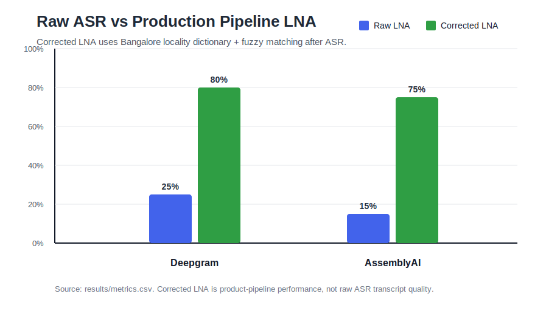
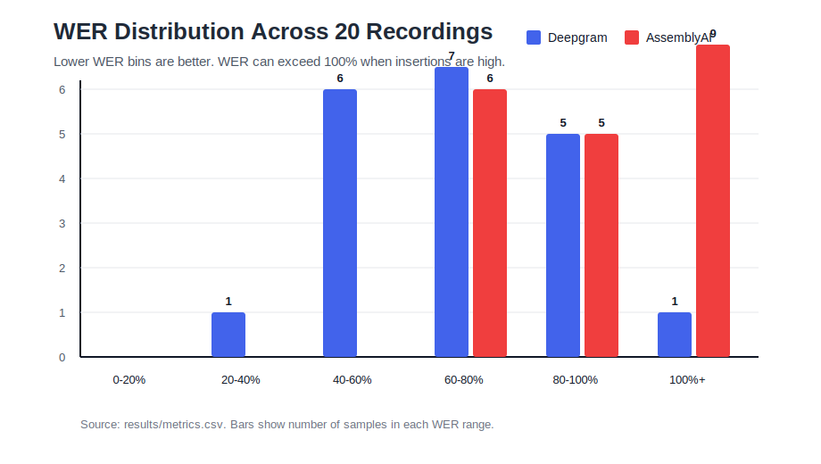

# ASR Benchmark - Indian Conversational Speech

## HLD


## LLD


This project benchmarks ASR systems on self-recorded Bangalore locality utterances for a blue-collar hiring workflow. The primary business metric is whether the locality name is transcribed correctly, not just aggregate WER.

The production recommendation is:

```text
Audio
  -> Deepgram first-pass ASR
  -> raw transcript
  -> text normalization
  -> Bangalore locality dictionary + fuzzy matching
  -> confidence score
  -> auto-accept or review
```

## Folder Structure

```text
asr/
  README.md
  requirements.txt
  run_benchmark.py
  recompute_metrics.py
  .env.example
  .gitignore

  data/
    ground_truth.json
    recording_manifest.csv
    recordings/
      bellandur_noisy_hindi_10.wav
      btm_layout_noisy_hindi_08.wav
      byatarayanapura_quiet_hindi_11.wav
      doddanekundi_quiet_hindi_whispered_19.wav
      electronic_city_quiet_hinglish_04.wav
      hebbal_quiet_hindi_rushed_17.wav
      hsr_layout_phone_hinglish_07.wav
      indiranagar_quiet_hinglish_02.wav
      jayanagar_quiet_hindi_06.wav
      kadugondanahalli_noisy_hinglish_12.wav
      kengeri_upanagara_quiet_hindi_15.wav
      koramangala_quiet_hindi_01.wav
      kothanur_dinne_noisy_hinglish_14.wav
      marathahalli_noisy_hindi_05.wav
      rajarajeshwarinagar_quiet_hindi_13.wav
      silk_board_quiet_hinglish_09.wav
      thalaghattapura_noisy_hinglish_16.wav
      thanisandra_phone_hinglish_20.wav
      whitefield_noisy_hindi_03.wav
      yelahanka_quiet_hinglish_rushed_18.wav

  docs/
    HLD_LLD_PRODUCTION_PIPELINE.md
    asr_pipeline_hld_lld.excalidraw

  results/
    raw_transcripts.csv
    metrics.csv
    report.md
    production_pipeline_summary.md

  src/
    asr_benchmark/
      __init__.py
      audio_loader.py
      env.py
      ground_truth.py
      locality_matcher.py
      metrics.py
      report.py
      schema.py
      adapters/
        __init__.py
        base.py
        deepgram_adapter.py
        assemblyai_adapter.py
        whisper_adapter.py
        hf_inference_adapter.py
        indic_adapter.py
        registry.py

  tests/
    test_metrics.py
```

## Model Plan

Required baseline:

- `deepgram`: Deepgram Nova, API-based production baseline.

Recommended comparison set:

- `assemblyai`: API-based production alternative for latency/cost comparison.
- `whisper`: local OpenAI Whisper, strong multilingual open-source baseline.
- `hf-whisper`: Hugging Face-hosted Whisper, useful when local torch/ffmpeg setup is blocked.
- `indic`: Hugging Face Indic ASR model, useful when compute allows.

Completed benchmark results currently include:

- `deepgram`
- `assemblyai`

Adapters are included for Whisper, Hugging Face Whisper, and Indic ASR so the benchmark can be extended without changing the evaluation engine.

## API Keys Needed

- `DEEPGRAM_API_KEY` - required for Deepgram.
- `ASSEMBLYAI_API_KEY` - required for AssemblyAI.
- `HF_TOKEN` - required for `hf-whisper` or gated Hugging Face models.
- `OPENAI_API_KEY` - not needed for the default local Whisper path.

Do not submit `.env`. Submit `.env.example` and ask the evaluator to fill their own keys.

## Quick Start

```powershell
cd D:\asr
python -m venv .venv
.\.venv\Scripts\Activate.ps1
pip install -r requirements.txt
Copy-Item .env.example .env
```

Put the 20 recordings in `data/recordings/`, then edit `data/ground_truth.json` with the exact sentence spoken in each file.

Run a small smoke test with metrics only:

```powershell
python -m unittest discover -s tests
```

Run the benchmark:

```powershell
python run_benchmark.py --models deepgram,assemblyai
```

If Hugging Face upload is approved, run:

```powershell
python run_benchmark.py --models deepgram,assemblyai,hf-whisper
```

Recompute metrics from saved transcripts without rerunning APIs:

```powershell
python recompute_metrics.py --transcripts results/raw_transcripts.csv results_assemblyai_fixed/raw_transcripts.csv --results-dir results
```

## Outputs

- `results/raw_transcripts.csv` - raw ASR outputs.
- `results/metrics.csv` - WER, CER, raw LNA, corrected LNA, latency, review flags.
- `results/report.md` - final concise report.
- `results/production_pipeline_summary.md` - product-level summary of ASR + locality correction.

## Current Results

| Model | Raw LNA | Corrected LNA | Auto-Accept Correct | Review Rate | Auto-Wrong | Avg WER | Avg CER | Avg Latency |
| --- | ---: | ---: | ---: | ---: | ---: | ---: | ---: | ---: |
| Deepgram | 25.0% | 80.0% | 11/20 | 45.0% | 0 | 64.8% | 33.9% | 4.8s |
| AssemblyAI | 15.0% | 75.0% | 14/20 | 30.0% | 0 | 91.4% | 49.8% | 12.2s |

## Result Visualizations

### Raw ASR vs Production Pipeline LNA



### WER Distribution



## Metrics

- `WER`: Word Error Rate. Measures full transcript word mistakes.
- `CER`: Character Error Rate. Measures spelling/character mistakes.
- `Raw LNA`: Whether ASR directly captured the locality name.
- `Corrected LNA`: Whether the locality dictionary matcher recovered the right locality.
- `Auto-Accept Correct`: Correct locality predictions accepted above confidence threshold.
- `Review Rate`: Low-confidence predictions sent to human review or second-pass ASR.
- `Latency`: Time taken by the ASR API.

## Recording Guidance

Use natural phone-call style sentences. Do not record all clips in the same tone and room. The report is stronger when the dataset includes quiet, noisy, phone-like, rushed, and whispered samples.

The included `data/recording_manifest.csv` gives a balanced 20-sample plan.

## Report Positioning

Keep `results/report.md` under three pages. Lead with:

1. Which model should be used and under what constraint.
2. Locality Name Accuracy first, then WER/CER.
3. Raw ASR result versus ASR + locality correction result.
4. Three concrete failures with ground truth vs model output.
5. Caveats: single speaker, small sample size, limited noise profiles, compute/API constraints.

## Final Recommendation

Use Deepgram as the first-pass ASR because it has better raw transcript quality and lower latency than AssemblyAI in this benchmark.

Do not use raw ASR output directly for job matching. Apply locality dictionary + fuzzy matching, auto-accept high-confidence matches, and route low-confidence cases to human review or a second-pass ASR model.

